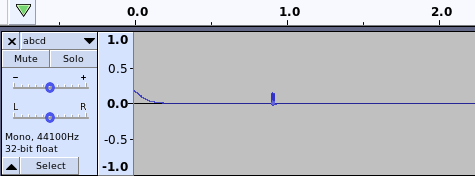

# Calibrate

Calibration consists of:

  * Transmitting data from the HP48G to the computer until the transmitted signal is reliably detected by the computer.

  * Transmitting data from the computer to the HP48G until the transmitted signal is reliably detected by the HP48G.

There are a few things that can be adjusted to improve signal strength. Adjust them as needed.

* __Orientation__ Try to ensure the transmitter and receiver are directly inline with each other. This is difficult to do because the HP48G's IR elements are not visible. Interestingly, the IR elements of the HP48G are angled 10 degrees down from horizontal. You may wish to do likewise.

* __Distance__ If the transmitter and receiver are aligned, decreasing the distance will increase signal strength. However, if the transmitter and receiver are misaligned and are very close to each other, _increasing_ the distance might help as it may allow some (or more) of the transmitted light to fall onto the receiver.

* __Volume__ Increasing the microphone and/or headphone volume will help strengthen any signal which, in turn, will make decoding the signal more reliable.

* __Battery__ Weak batteries will transmit a weakened signal. Ensure that the batteries are fresh.

* __Shielding__ In some cases, blocking all external light (e.g. by covering the calculator and transceiver with an overturned shoe box) may help. Sunlight, and other sources, emit IR light which can cause interference.

### A Note of Caution

> Calibrating your home-made transceiver will 'connect' the HP48G to the sound card in an electrical circuit.
>
> Although unlikely, the possibility exists that the HP48G, the sound card, and/or your home-made transceiver could be permanently damaged. I am not responsible for any damage to your hardware.
>
> The '[HP 48 I/O Technical Interfacing Guide](./48techni.pdf)' specifies electrical circuits for both an IR transmitter and an IR receiver. If you have any concerns about using your home-made transceiver, compare the voltages, power, etc. of your transmitter and receiver with those found in the I/O Guide.

Proceed at your own risk.

## Pre-requisites

1. Ensure the clock is not ticking.

1. Ensure that the communication parameters (`[L-Shift]` `[I/O]` `|IOPAR|`) are configured for `IR`, `binary`, `2400` baud, parity `none`. For calibration, parity should be `none`. After calibration has been completed, parity can be set to anything.

1. Ensure the serial port has been opened. (`[L-Shift]` `[I/O]` `[NXT]` `|SERIAL|` `|OPENIO|`).

   The circuitry of the I/O port must be powered in order for the HP48G to receive data. What this means is that when transmitting _to_ the HP48G, its I/O port will not receive any data until the I/O port has been opened (with OPENIO). When transmitting _from_ the HP48G, the I/O port will automatically be opened. The I/O port can be closed by executing `[L-Shift]` `[NXT]` `|CLOSEIO|` or turning the HP48G off. Closing the I/O port when it is not needed will conserve battery power.

## Calibrate receiver (Transmit from HP48G to computer)

1. Find a working infrared (IR) remote

    * Wireless remotes have used a variety of technologies to transmit a signal. The [Zenith Flash-matic](https://www.vintag.es/2019/11/zenith-flash-matic.html) used visible light and the 'Zenith Space Commander' used high frequency sound. Modern-day remotes use IR, RF, Bluetooth, or Wifi to control devices.

    * If the remote must be pointed at the device in order to control the device, then the remote is probably an IR remote. If the remote can control the device when pointed away from the device, or when line-of-sight is obstructed, then the remote is almost certainly not an IR remote.

    * TV remotes are almost always IR remotes.

1. Verify that your smartphone camera can see IR light.

    * Open your smartphone camera app.

    * Point the remote at your smartphone camera.

    * Press a few buttons on the remote.

    * The camera should see the IR element illuminate on the remote.

1. Verify the HP48G can transmit.

    * Point the HP48G's IR port at your smartphone's camera.

    * Put a string on the stack. e.g. `"ABCDE"`.

    * Transmit the string via the serial port. (`[L-Shift]` `[I/O]` `[NXT]` `|SERIAL|` `|XMIT|`)

    * The camera should see the HP48G's IR transmitter briefly illuminate.

1. Verify the microphone port is working.

    * Plug a microphone into the microphone port.

    * Record a mono WAV file using any suitable method. [Audacity](https://www.audacityteam.org/) is a cross-platform audio program. If alsa-tools is installed `arecord -d 5 -f cd -t wav -c 1 > mic_input.wav` will record a 5-second mono WAV file.

    * Verify that audio was recorded.  

1. Verify that HpirComm can record audio.

    * Set the microphone to its lowest volume.

    * Plug a microphone into the microphone port.

    * Execute `python hpir.py --serial --receive in.dat --timeout 5 --wavprefix test` which will record for 5 seconds.

    * While HpirComm is recording, speak into the mic.

    * When HpirComm exits, it will have recorded three files: `in.dat`, `test_tx.wav` and `test_tx.wav`. The first two are not needed and should be deleted.

    * Verify that `test_tx.wav` recorded something. e.g. Play it back or view it in an audio editor.

    * If nothing was recorded, delete `test_rx.wav`, increase the microphone volume a bit and try again.

1. Calibrate the receiver

    The following process will be used to calibrate the receiver:

        ======== Overview for Calibrating Receiver ========

        Separate HP48G and transceiver by a 'large' distance  <----|
        Set microphone volume to its lowest level                  |
        Transmit bytes from HP48G <-----------------------|        |
        Was a good signal received by computer?           |        |
            YES -> Success. Stop.                         |        |
            NO  -> Can transceiver be moved closer?       |        |
                      YES -> Move transceiver closer -----|        |
                      NO  -> Is mic volume at max volume?          |
                               YES -> Failure. Stop.               |
                               NO  -> Increase mic volume ---------|

    I would expect that the calibration process will be successful as it has worked with IR emitters from three different remotes. However, your hardware and software (e.g. soundcard drivers) will differ.

    * Set the microphone to its lowest volume.

    * Plug the receiver into the microphone port.

    * Separate the receiver and the HP48G by a 'large' distance. The HP48G User's Guide states that when using IR to transfer data between two HP48G's, the calculators should be "no farther apart than 2 inches". If you want to be extra-cautious, increase the distance to something like six inches.

    * Put a string on the stack. e.g. `"ABCD"`

    * Execute `python hpir.py --serial --receive in.dat --timeout 5 --wavprefix calib` which will record for 5 seconds and create `calib_rx.wav`. It will also create `in.dat` and `calib_tx.wav`, which can be deleted.

    * While `hpir.py` is recording, transmit the string from the HP48G. `[L-Shift]` `[I/O]` `[NXT]` `|SERIAL|` `|XMIT|`

    * After `hpir.py` has exited, examine `calib_rx.wav` in an audio editor. You want something like this:

    

    * Ignore any artifacts at the beginning of the WAV file. The WAV file shown above has a 'ramp down' artifact at the start of it. You may see different artifacts. The 'spike' near the 1.0 second mark is desirable. Your 'spike' might be taller or shorter, depending on your hardware and software setup.

    * Ideally, the magnitude of the spike should be about 0.5 (but I have never actually achieved that with my setup). If the magnitude of the spike is more than 0.5, the signal is unnecessarily strong; consider decreasing the microphone volume or increasing the distance.

    * If no spike is visible, move to the next step of the process in the 'Overview' at the beginning of this section. e.g. Move the receiver closer or increase the microphone volume.

    * The following program is optional, but may be useful to speed up the calibration process. Use an audio recording program with a 'live view' (e.g. Audacity) to see the strength of the received signal in real time and adjust distance and volume as needed. Be sure the audio program is recording MONO, not STEREO. The signal strength seen by the audio program may not exactly match the signal strength seen by `hpir.py`, so 'manual' calibration may also be necessary.

          %%HP: T(3)A(D)F(.);
          @ This transmits bytes from the serial port with
          @ a small delay (~2 sec) between each byte.
          @ The delay length depends on processor speed.
          @ A beep will sound when done, if BEEP is enabled.
          @ When running, pressing 'ON' will stop the program.
          @
          @ 65 90:   Range of ASCII char-codes to emit. 65-90 are
          @          the char-codes for the letters A-Z.
          @ 500:     Controls the length of the delay between
          @          bytes. Larger values increase the delay.
          @ 1400 .08 Frequency and Duration for BEEP command.
          \<<
            65 90 FOR I                 @ Char-codes to transmit
              I CHR XMIT DROP           @ Transmit char
              0 500 START 0 DROP NEXT   @ Busy loop
            NEXT
            1400 0.08 BEEP              @ Make sound
          \>>

1. Compute the sensitivity

  * After a satisfactory mono WAV file has been recorded, run `python decode_wav.py --calibrate --echo mic_input.wav`. This will read a mono `.wav` file and try to extract the encoded data that it contains. The `--echo` parameter will print the decoded data to the screen. The `--calibrate` parameter will compute a _sensitivity_ value and print it on the screen  (e.g. `sensitivity = 0.14`).

  * The sensitivity value should not be used during calibration, but should always be supplied to `hpir.py` after calibration is complete. The sensitivity value can be supplied to `hpir.py` either as a command line parameter (e.g. `--sensitivity 0.14`), or as a comment in `hpir.ini` (e.g. `; args: --sensitivity 0.14`).

  * The `decode_wav.py` program will also write a file named `mic_input.wav.bin` which contains the decoded data. If all went well, the bytes that were received will match the bytes that were sent. It is not unusual for the start and/or end of the data to have been corrupted; this does not necessarily indicate a problem. Data in the middle of the transmission should not have been corrupted.

  * The `mic_input.wav` and `mic_input.wav.bin` files can be deleted.

## Calibrate transmitter (Transmit from computer to HP48G)

    ======== Overview for Calibrating Transmitter ========

    Set headphone volume to its lowest level
    Transmit bytes from computer <-------------------|
    Was a good signal received by HP48G?             |
        YES -> Success. Stop.                        |
        NO  -> Is headphone volume at max volume?    |
                 YES -> Failure. Stop.               |
                 NO  -> Increase mic volume ---------|

Once the receiver has been calibrated, don't alter the distance between the HP48G and the receiver.

1. Ensure the soundcard output is working

   * Plug headphones into the headphone port

   * Playing something.

   * You should hear something.

1. Verify the computer can transmit

   * Set the headphone volume to its lowest level.

   * Plug the transmitter into the headphone port.

   * Open the camera app on your smartphone.

   * Point the transmitter at your smartphone camera

   * Run `python hpir.py --serial --chars ABCDE`

   * The camera should see the IR emitter briefly illuminate. IR emitters require a minimum voltage before they will illuminate. You may need to increase the headphone volume substantially before enough voltage is supplied to the IR emitter for it to illuminate. For the IR emitter that I use (salvaged from a Fisher PH-DTA300 remote), I have to set my headphone volume at, or near, its maximum before the IR emitter will illuminate.

1. Send data from the computer to the HP48G

    * Align the transmitter with the HP48G.

    * Open the HP48G's I/O port.

    * Send some data from the computer using `python hpir.py --serial --send ABCDEF`. Alternatively, `hpir.py` can be used to transmit data periodically. To do so, add the following lines to `hpir.ini`:

          ; Transmit 'ABCDEF' via the serial port and then wait 2 seconds.
          ; Copy-and-paste the next two lines as many times as desired
          serial send chars ABCDEF
          wait 2

      Running `python hpir.py` will execute the commands in `hpir.ini`.

1. Examine received data.

  * `[L-Shift]` `[I/O]` `[NXT]` `|SERIAL|` `|BUFLEN|`  will put two numbers on the stack. The top of the stack will be the success status: `1` means success, `0` means an error occurred. The next number on the stack is the number of bytes that are in the serial buffer.

  * `[DROP]` `|SRECV|` will clear the result status and then fetch the received bytes from the serial buffer and place them on the stack.

  * If the bytes that were received match the bytes that were sent, calibration is complete. If there is corruption only at the start and/or end of the received data, it does not necessarily indicate a problem. This type of corruption is 'normal' and can be caused by a variety of factors; further testing should be done. However, if there is corruption anywhere else in the received data (i.e. in the middle), calibration is not complete. If calibration is not complete, increase the headphone volume and try re-transmitting data.

  * After calibration is complete, you may wish to increase the microphone volume a little bit more in order to add a bit of a 'safety factor' for things like weak batteries, and poor alignment.

Now that your transceiver has been calibrated, it can be used communicate with the HP48G using the Kermit, XMODEM, or serial protocol. Whenever you use your transceiver, ensure that the distance and volume levels match what was used during calibration.

# Misc

  * SRECV consumes one number from the stack. If that number exceeds the number of bytes that are available in the serial buffer, the HP48G will block until the specified number of bytes has been read.

  * The Transmit Circuit in the '[HP 48 I/O Technical Interfacing Guide](./48techni.pdf)' uses an NEC SE303A as the IR emitter. The [NEC SE303A datasheet](./NEC-SE303A.pdf) specifies the Forward Voltage is 1.25v. The headphone port of a soundcard typically has a peak-to-peak voltage of 2.2v. HpirComm generates WAV data that will output about half of the peak-to-peak voltage. The electrical characteristics of your soundcard and the IR emitter in your transmitter may differ significantly from the values above.

  * In the unlikely case that the HP48G is having trouble receiving a signal, the  sensitivity of the HP48G's receiver can be increased, but it requires a [hardware modification](https://www.hpcalc.org/hp48/docs/misc/irrange.txt). Use at your own risk.
