# Hardware

In order for the sound card to communicate with the HP48G IR port, a hardware device must be constructed.

The device can be constructed from the following three items:

 1. A male-to-male 3.5mm audio cord (mono or stereo)
 1. An IR emitter (a.k.a. IR LED)
 1. An IR photodiode (or a second IR emitter)

For item 3, if possible, use an IR photodiode rather than a second IR emitter. Either will work, but an IR photodiode will perform much better than an IR emitter. The advantage of using two IR emitters is that they are relatively easy to find as they can be salvaged from old remote controls.

The [*HP 48 Technical Interfacing Guide*](./48techni.pdf) specifies that the IR wavelength used for communication is 940nm. This is the same wavelength that many consumer IR remotes transmit at.

> If you only have a *single* IR emitter (i.e. you do not have an IR photodiode or second IR emitter), it is still possible to communicate with the HP48G, but communication will be severely restricted because the single IR emitter can be used to either *only* transmit or *only* receive.
>
> In theory, use of IR photodiodes could be used instead of IR emitters, but that has not been tested.

The construction is simple.

 1. Cut the audio cord in half
 1. Wire the IR emitter to one half of the audio cord
 1. Wire the IR photodiode (or the second IR emitter) to the other half of the audio cord

#### Schematics

The ASCII art below depicts a stereo 3.5mm jack. A mono 3.5mm jack will not have the Ring/Right section, instead, the Sleeve will be lengthened.

       _    _____________
      ( )                  Tip/Left
      |_|   _____________
      |_|   _____________  Ring/Right
      | |
     _|_|_  _____________  Sleeve/Ground
    |     |
    |     |
    |     |
    \     /
     \___/
      ||
      ||

#### IR Transmitter
       _
      ( ) ______________________
      |_|                    __|_
      |_|                    \  /   IR emitter (a.k.a. IR LED)
      | |_______            __\/__
     _|_|_      |              |
    |     |     |______________|
    |     |
    |     |
    \     /
     \___/
      ||
      ||

#### IR Receiver (using an IR photodiode)
       _
      ( ) ______________________
      |_|                    __|__
      |_|                     /\    IR photodiode
      | |_______             /__\
     _|_|_      |              |
    |     |     |______________|
    |     |
    |     |
    \     /
     \___/
      ||
      ||

Note that the IR photodiode is wired 'backwards' (as compared to the IR emitter). Infrared light shining on the IR photodiode will induce a current to flow from tip to sleeve.

# Development

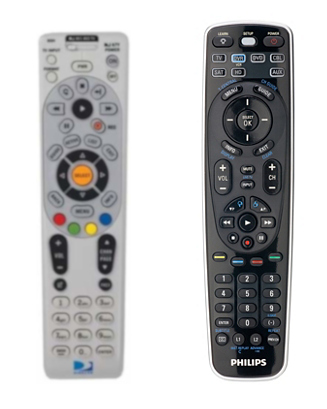

I had two remotes: a DirectTV-RC64 (left) and a Philips SRU107.

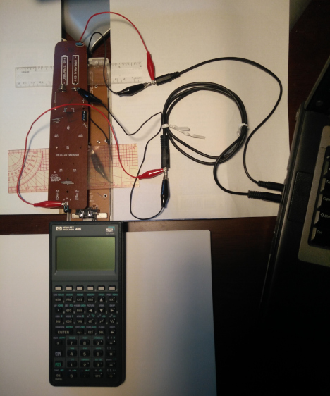

Here was my development setup. The disassembled remotes were positioned to align their IR emitters with the HP48G's IR elements as best as possible.

The Philips remote, left, was used for transmitting (from the headphone output) and transmits to the HP48Gs IR photodiode. The DirectTV remote, right, was used for receiving (to the microphone input) and listens to the HP48Gs IR transmissions.

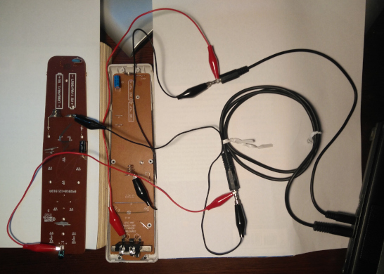

The Philips remote has been moved to the side to show the lower remote.

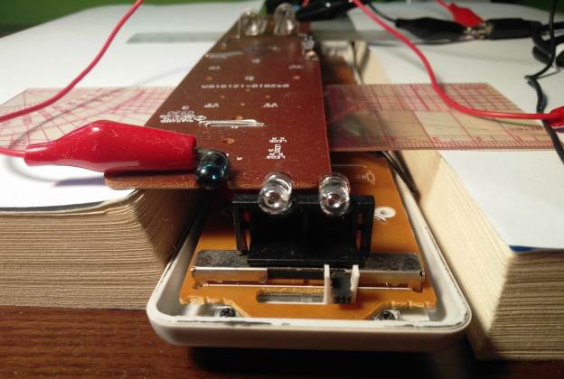

The DirectTV remote, bottom, has two IR emitters which are electrically 'tied' together. As a result, they cannot be driven separately while attached to the board. Since I didn't want to separate the IR emitters from the board, I could only use one of the IR emitters. The left one was used to receive; the right one was not used at all.

On the DirectTV remote, if the leads of both IR emitters are cut, the left one could be used for the transmitter and the right one could be used for the receiver; their physical position aligns very nicely with the HP48G's IR elements.

# Construction

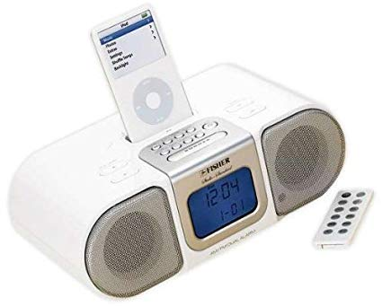

Although the two remotes worked fine, I didn't want to separate the IR emitters from the boards they were attached to, so I salvaged an IR receiver and its remote from an old Fisher PH-DTA300. The IR receiver is located behind the small black circle on the right speaker grill.

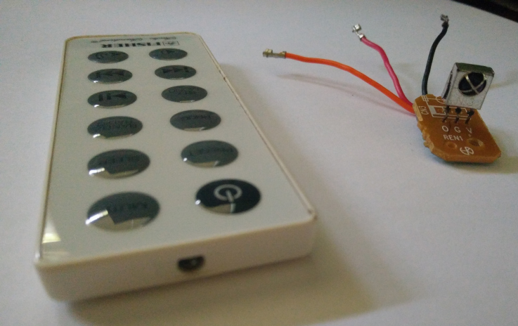

The remote and IR receiver (right) extracted from the PH-DTA300.

> Sometimes IR receivers are protected with a metal cage (as seen above). The metal is sharp and can easily scratch the soft plastic covering the HP48G's IR elements.

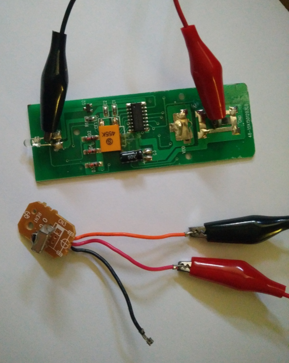

Testing the PH-DTA300 components.

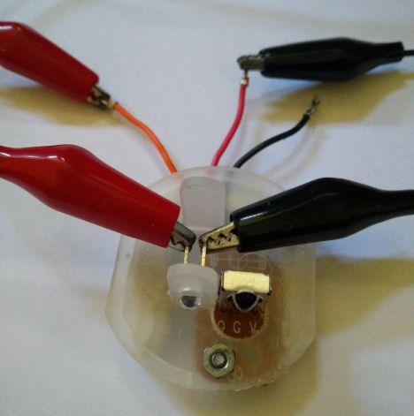

The IR emitter and IR receiver were added to a plastic 'frame'. The frame is a wall plug for covering electrical outlets, which I drilled holes in.

If exact dimensions for the positioning of the IR emitter and IR photodiode are desired, consult the [*HP 48 Technical Interfacing Guide*](./48techni.pdf).

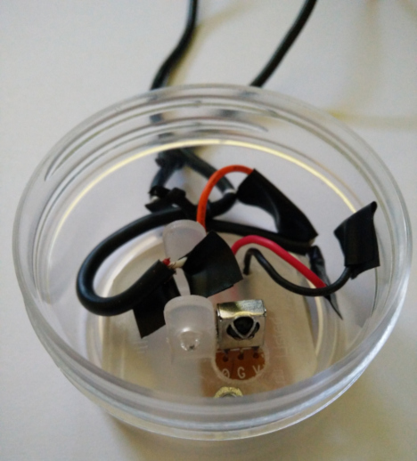

This physical packaging is far from ideal, but it's all that I had available. When in use, the IR receiver, on the right, is quite a distance away (about 2cm) from the HP48G. As a result, the microphone must be turned up to its maximum volume to get a good signal. During testing, the IR receiver was almost touching the HP48G, which resulted in a stronger signal at a lower microphone volume.

There is no requirement that the IR photodiode and IR transmitter must both be an equal distance away from the HP48G. You may get better results when they are at different distances.

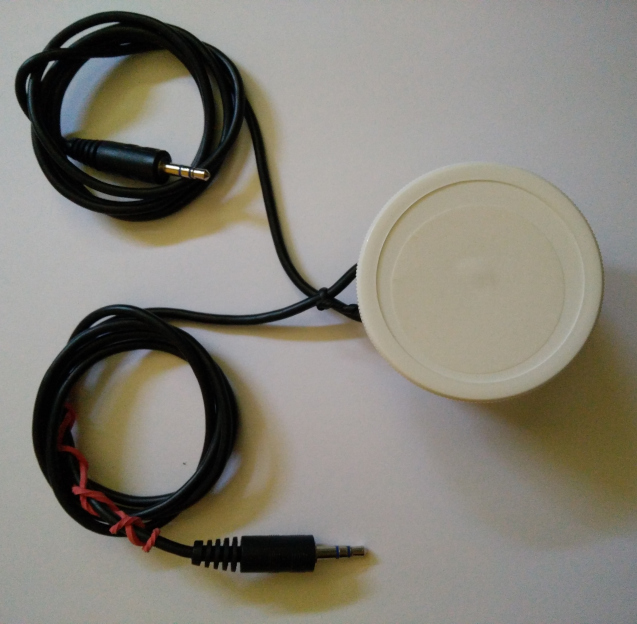

The finished device. A white screw-top encloses the case. A red rubber band was added to headphone jack to distinguish it from the microphone jack.

Although the IR receiver salvaged from Fisher PH-DTA300 worked for me I would recommend NOT using an IR receiver. Use IR photodiodes and/or IR emitters, instead. I do not know if the Fisher IR receiver worked because it was 'compatible' with the HP48G or because I accidentally electrically damaged the component (which may have burnt out or shorted internal components). The wiring below worked for me.

                                    _
         __________________________( )
        |                          |_|
        |                          |_|
        |     _____________________| |
        |    |                    _|_|_
        |    |   (Not used)      |     |
    ____|____|____|____          |     |
    |  Out   Vs  GND  |          |     |
    |_____        ____|          \     /
          \______/                \___/
                                   ||
                                   ||

I also tried using a (disassembled) Streamzap IR receiver. It did not work. More accurately, many bytes transferred correctly, but some were always corrupted.

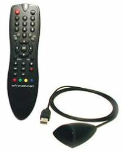

A Streamzap remote and receiver.

#### IR photodiode vs. IR emitter vs. IR receiver

An __IR photodiode__ is a simple electrical component. It has two pins. When infrafred light falls on it, it allows a current to pass. When no light falls on it, then no current may pass. The stronger the infrared light, the more current is allowed to pass.

An __IR emitter__ (a.k.a. IR LED) is a simple electrical component. It has two pins. When current flows through it, it emits light in the infrared range. Just as a speaker can be used as a poor microphone, or a motor can be used as a poor generator, an IR emitter can be used as a poor IR photodiode.

An __IR receiver__ is a more complex electrical component. It has three pins and internal circuitry. An IR receiver is 'matched' with an IR transmitter (a.k.a. remote). When a button is pressed on the remote, it generates a code. In simple terms, the code is added to a carrier frequency and the IR transmitter emits the resulting signal as IR light. When the IR light from the remote falls on the IR receiver, the IR receiver filters out the carrier frequency, leaving the transmitted code. The code is then output by the receiver.

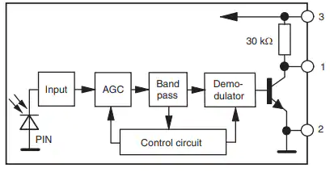

A block diagram of an IR receiver ([source](https://www.mouser.com/new/vishay/vishay-tsopx-ir-receivers/)). IR receivers have internal circuitry that may interfere with the 'raw' signal emitted from the HP48G.
